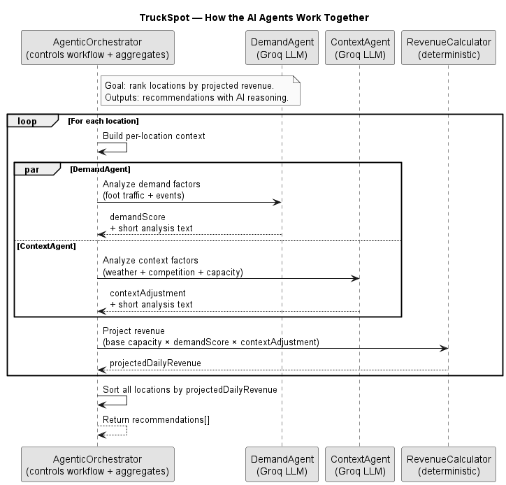

# TruckSpot - AI-Powered Location Recommendation System

An intelligent location recommendation system for food trucks, powered by multi-agent AI architecture.

## Table of Contents

- [Quick Start](#quick-start)
  - [Setup Instructions](#setup-instructions)
  - [How to Use the App](#how-to-use-the-app)
- [Tech Stack](#tech-stack)
- [Multi-Agent AI System Architecture](#multi-agent-ai-system-architecture)
- [Agent Descriptions](#agent-descriptions)
- [API Endpoints](#api-endpoints)
- [Pricing (Pay-as-you-go booking)](#pricing-pay-as-you-go-booking)

## Tech Stack

- **Frontend**: React + Vite + Bootstrap 5 + Leaflet (maps)
- **Backend**: Node.js + Express
- **AI**: Groq API (Llama 3.1 8B Instant)
- **Data**: Mock JSON files (locations, weather, events, etc.)

## Setup Instructions

### Prerequisites

- Node.js 18+ installed
- A Groq API key (get one at https://console.groq.com)

### 1. Clone the Project

```bash
git clone <repository-url>
cd truck-spot
```

### 2. Configure Environment Variables

Before starting the app, you need to set up your environment configuration.

**Create a `.env` file in the `backend/` directory:**

```bash
cd backend
```

**Add the following environment variables to `backend/.env`:**

```env
PORT=5000
NODE_ENV=development
GROQ_API_KEY=your_groq_api_key_here
CORS_ORIGIN=http://localhost:5173
JWT_SECRET=change_me_to_a_long_random_string

# Pay-as-you-go payments (Stripe)
STRIPE_SECRET_KEY=your_stripe_secret_key
FRONTEND_URL=http://localhost:5173

# Pricing configuration
# Booking payments are always RON (Stripe currency code: ron)
BOOKING_BASE_FEE_RON=60
PAYMENTS_REQUIRED=true
# Optional caching controls (agentic endpoints)
# CACHE_TTL_MS=86400000
# CACHE_DEBUG=true
# Optional (defaults to backend/var/truckspot.db)
# SQLITE_DB_PATH=./var/truckspot.db
```

- `GROQ_API_KEY`: Your API key from https://console.groq.com (required for AI agents to work)

**Stripe (required for bookings):**

- `STRIPE_SECRET_KEY`: Required for pay-as-you-go parking bookings (Stripe Checkout). Get it from your Stripe Dashboard → Developers → API keys.
- `FRONTEND_URL`: Where Stripe should redirect after Checkout (default is `http://localhost:5173`).

**Create a `.env` file in the `frontend/` directory (Vite uses `VITE_`-prefixed vars):**

```bash
cd ../frontend
```

**Add the following environment variables to `frontend/.env`:**

```env
VITE_API_URL=http://localhost:5000

# Optional UI labels
VITE_APP_NAME=TruckSpot
# VITE_APP_VERSION=1.0.0
```

- `VITE_API_URL`: Base URL of the backend API (required)
- `VITE_APP_NAME`: Display name in the header (optional)

### 3. Setup and Start Backend

```bash
# Navigate to backend (if not already there)
cd backend

# Install dependencies
npm install

# Start the backend server
npm run dev
```

The backend will run at http://localhost:5000

### 4. Setup and Start Frontend

```bash
# Navigate to frontend (in a new terminal)
cd frontend

# Install dependencies
npm install

# Start the development server
npm run dev
```

The frontend will run at http://localhost:5173

### 5. Verify Setup

1. Backend should be running at http://localhost:5000
2. Frontend should be running at http://localhost:5173
3. Visit http://localhost:5000/api/agents/health to verify AI agents are configured

## How to Use the App

### For Food Lovers (Guests)

1. **View the Map**
   - Open the homepage and browse the interactive map showing all food truck locations
   - Click on any location marker to see more details
   - View available parking spots and which food trucks are serving there today

2. **Explore Locations**
   - Click a marker on the map or a location name to open the details panel
   - See location information: type, capacity, parking availability
   - Browse food trucks currently reserved at that location
   - Click on a food truck to view its profile (if available)

### For Food Truck Owners

#### 1. Register & Login

1. Click the **Login** button in the top-right corner
2. Select **Register** to create a new account
3. Fill in the owner information:
   - **Email** and **Password** (8+ characters)
   - **Truck Name** (e.g., "Tasty Tacos")
   - **Cuisine** (optional, e.g., "Mexican")
   - **Description** (optional, e.g., "Street tacos and burritos")
   - **Phone** (optional)
4. Click **Create account** to finish registration

#### 2. Use AI Recommendations

1. After logging in, navigate to the **"AI-Powered Recommendations"** section on the homepage
2. Select a date using the date picker at the top
3. Click **Generate** to get AI recommendations for that date
   - The system analyzes foot traffic, events, competition, and weather
   - First generation may take up to 30 seconds (subsequent requests are cached)
4. Review the recommendations displayed as cards showing:
   - **Demand Score** (0-1): How much customer interest
   - **Revenue Projection** (RON): Estimated daily revenue
   - **Foot Traffic**: People per hour expected
   - **Risk Level**: LOW, MEDIUM, or HIGH risk assessment

5. Click **View Details** on any recommendation card to see:
   - Full location information
   - **AI Reasoning**: Detailed analysis from demand and context agents
   - Scrollable analysis sections with complete AI reasoning

6. **Track Recommendations Across Dates**
   - The app shows which date the recommendations are for
   - If you change dates, you'll see a warning: "⚠️ Click Refresh to generate for [new date]"
   - Switching back to a previously analyzed date instantly restores cached results
   - Future dates are generated first, then past dates

#### 3. Make Parking Reservations

1. In the **Recommendations** section or location details, expand a day's reservations
2. Select an available parking spot from the dropdown
3. View the **booking fee** (varies by location rank and availability)
4. Click **Pay & Reserve** to complete the booking
   - You'll be redirected to Stripe Checkout
   - Complete payment in RON (Romanian currency)
   - Upon success, return to TruckSpot to confirm the reservation

4. **View Your Reservations**
   - The **My Reservations** section shows all your bookings organized by date
   - **Today's reservations** are always visible and expanded
   - Click the arrow (▶) to expand **Upcoming** or **Past** reservations
   - See location name, spot number, and booking creation time in an organized table

5. **Manage Reservations**
   - Click **Release** to cancel a parking spot reservation
   - Refresh to see the latest availability and booking information

#### 4. Location Guide

Each location card shows:
- **Location Name & Zone**: Where the location is
- **Type**: Park, street, event venue, etc.
- **Capacity**: How busy it gets (low, medium, high, very_high)
- **Parking Spots**: Number of available spots
- **Base Score**: Baseline suitability score
- **Description**: Details about the location

#### 5. Tips for Best Results

- **Generate early**: Generate recommendations at the start of your planning day
- **Check multiple dates**: Compare upcoming dates to find the best opportunities
- **Read the AI analysis**: Demand and Context analyses explain the reasoning
- **Watch for weather**: The AI factors in weather impacts (storms reduce foot traffic)
- **Monitor competition**: The system learns about competing food trucks
- **Book early**: High-rank locations (best revenue) book up quickly

## Multi-Agent AI System Architecture

### How the Agents Work Together



## Agent Descriptions

### 1. AgenticOrchestrator
- **Type**: Agentic AI (AI-driven decision making)
- **Model**: Groq Llama 3.1 8B Instant
- **Role**: Coordinates the entire workflow
  - Decides which agents to call using LLM reasoning
  - Manages parallel execution of agents
  - Aggregates results and sorts by revenue

### 2. DemandAgent
- **Type**: AI Agent
- **Model**: Groq Llama 3.1 8B Instant
- **Inputs**: Location, foot traffic, events
- **Output**: Demand score (0-1) + AI reasoning text
- **Example Prompt**:
  ```
  Analyze location demand. Location: University Square.
  Foot traffic: 1200 people/hour.
  Events: University Career Fair.
  Rate demand on scale 0-100 and explain your reasoning:
  ```

### 3. ContextAgent
- **Type**: AI Agent
- **Model**: Groq Llama 3.1 8B Instant
- **Inputs**: Location, weather, competition, capacity
- **Output**: Context adjustment (0.5-1.5) + AI reasoning text
- **Example Prompt**:
  ```
  Context analysis for food truck location.
  Weather: sunny, Impact multiplier: 1.1x.
  Competition density: low.
  Location capacity: very_high.
  Rate risk adjustment factor (0.5-1.5) and explain:
  ```

## API Endpoints

### Owner Auth (Food Truck)

Register a food truck owner account (includes basic truck profile fields at registration):

```
POST /api/auth/register
```

Example body:

```json
{
  "email": "owner@example.com",
  "password": "supersecret123",
  "truckName": "Tasty Tacos",
  "cuisine": "Mexican",
  "description": "Street tacos and burritos",
  "phone": "+40 700 000 000"
}
```

Login:

```
POST /api/auth/login
```

Get the logged-in owner profile (requires `Authorization: Bearer <token>`):

```
GET /api/auth/me
```

### Health Check
```
GET /api/agents/health
```
Returns AI system status, configured agents, and capabilities.

### AI Recommendations
```
GET /api/agents/recommendations/:date
```
Returns AI-analyzed location recommendations sorted by revenue.

**Response Structure**:
```json
{
  "success": true,
  "type": "agentic_ai",
  "date": "2026-04-04",
  "orchestrator": "AgenticOrchestrator",
  "model": "llama-3.1-8b-instant",
  "totalLocationsAnalyzed": 5,
  "recommendations": [
    {
      "location": { ... },
      "agenticAnalysis": {
        "decisions": {
          "demand": {
            "agent": "DemandAgent",
            "analysis": "LLM reasoning text...",
            "demandScore": 0.95
          },
          "context": {
            "agent": "ContextAgent",
            "analysis": "LLM reasoning text...",
            "contextAdjustment": 1.2
          },
          "revenue": {
            "projectedDailyRevenue": 864
          }
        },
        "recommendation": {
          "riskLevel": "LOW",
          "revenue": 864
        }
      }
    }
  ]
}
```

## Pricing (Pay-as-you-go booking)

Bookings require a one-time payment via Stripe Checkout.

### Currency

- Booking fees are always charged in **RON** (Stripe currency code: `ron`).

### Inputs

- `BOOKING_BASE_FEE_RON` (default: `60`): base booking fee (whole RON).
- `date` + `locationId`: used to compute the location's **rank** for that day.

### How rank is computed

1. The backend scores all locations for the selected date using the deterministic scoring service (`scoreAllLocations(date)`).
2. Locations are sorted by `estimatedRevenue` (highest first).
3. A location's **rank** is its 1-based position in that sorted list.

### Tiers

Rank is mapped to a tier:

- **Tier A**: rank 1–3 (multiplier `1.6`)
- **Tier B**: rank 4–10 (multiplier `1.2`)
- **Tier C**: rank 11+ (multiplier `1.0`)

### Price calculation

The quote is computed as:

- `amountRon = round(baseFeeRon × multiplier)`
- Stripe Checkout uses minor units: `unit_amount = amountRon × 100`

Example with `BOOKING_BASE_FEE_RON=60`:

- Tier C: `round(60 × 1.0) = 60 RON`
- Tier B: `round(60 × 1.2) = 72 RON`
- Tier A: `round(60 × 1.6) = 96 RON`

### Storage

- Payments are stored in SQLite table `reservation_payments` with `amount_ron` (whole RON) and `currency` (`ron`).